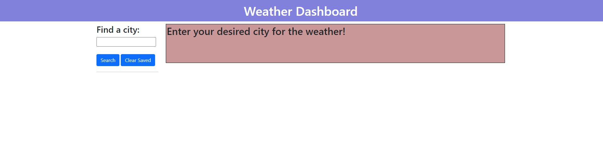

# weather-dashboard

## Description

The goal of this project is to create an application that allows users to view the current weather as well as the next five days. Using the OpenWeatherMaps Geocoding API, user's are able to input their city of their choosing to see the forecast of that city. In order to find the user's desired city, the API converts the latitude and longitude of the users input to generate the weekly forecast. This also allows users to see different information of that city such as temperature, humidity, and humidity levels as well. 

## Installation

N/A

## Usage

The application can be viewed via [GitHubPages](https://github.com/jxdang1/weather-dashboard) Users may enter their desired city that will pop up the current forecast as well as the upcoming five days' forecast. Users can also see their history by typing the desired city into the search bar and can also clear it from storage. 

Beginning screen of webpage:

When you type in the search bar of your desired city, it will pop up the current weather as well as for the next five days.

## Credits

Bootstrap and OpenWeatherMaps

## License

Please see license in github repo